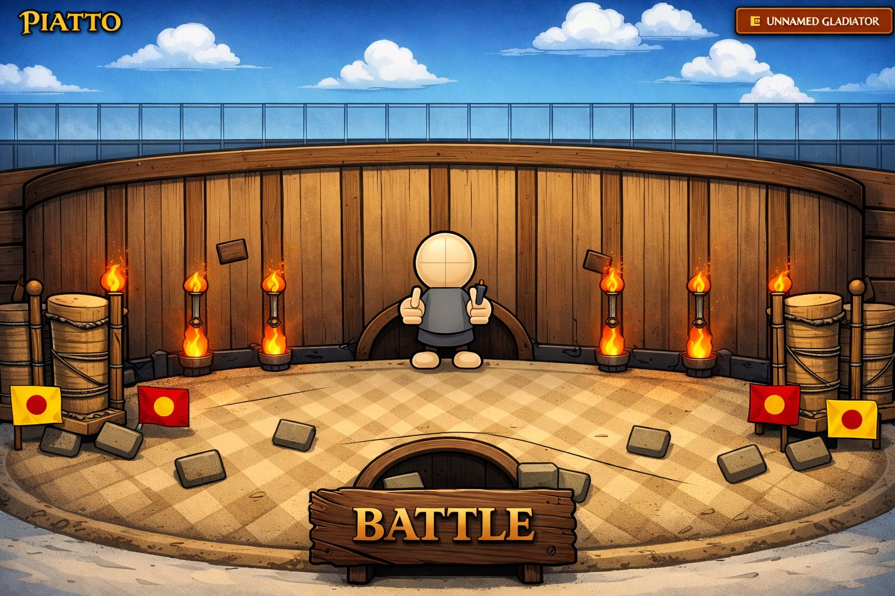
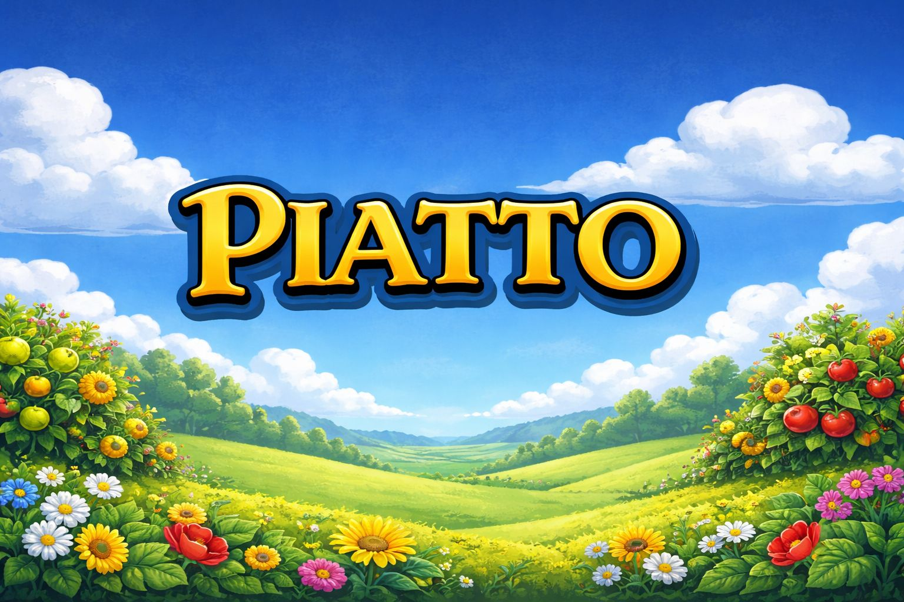

# PLAITO ⚔️

Gamified Pair Trading Platform

PLAITO is an immersive, gamified web application for pair trading, combining high-stakes financial betting with engaging game environments.




## 🌟 Features

### 🎰 Battle Arena (`/battle`)
A high-energy, casino-style betting interface where users wager on asset performance.
- **Casino Aesthetic**: Dark green felt backgrounds, neon ambient glows, and gold accents.
- **Real-time Interaction**: "Live Betting" indicators with animated pings.
- **Dynamic Odds**: Match cards display live multiplier ranges (e.g., "1.5x - 2.5x").
- **Tug-of-War Character**: Custom CSS-animated character representing the player's champion.

### 🚂 Archive / History (`/archive`)
A narrative-driven history page set in a Western Train Heist theme.
- **Immersive Environment**: Animated steampunk train moving through a landscape.
- **PnL Tracking**: Gamified display of wins and losses.
- **consistent Styling**: Aligned with the global design system (Crimson/Gold palette).

### 🏛️ Landing Page (`/`)
A Roman Colosseum-themed entry point.
- **Crowd System**: Dynamically sorted crowd characters with z-axis layering.
- **Atmosphere**: Animated torches and grand arena visuals.

## 🎨 Design System

PLAITO uses a unified, premium design language defined in `globals.css`:
- **Colors**: `plaito-gold`, `plaito-crimson`, `plaito-stone`, `plaito-obsidian`
- **Typography**: Custom fonts including *Cinzel Decorative* for headers.
- **Effects**: Custom utility classes like `.plaito-glow`, `.plaito-card`, and neon text effects.

## 🛠️ Tech Stack

- **Framework**: [Next.js 14](https://nextjs.org/) (App Router)
- **Styling**: [Tailwind CSS](https://tailwindcss.com/) + Custom CSS Variables
- **Protocol**: **Pear API Protocol** (Gamified Pair Trading)
- **Language**: TypeScript
- **Web3**: [Wagmi](https://wagmi.sh/) + [RainbowKit](https://www.rainbowkit.com/)
- **Icons**: [Lucide React](https://lucide.dev/)

## 🚀 Getting Started

1. **Install dependencies**:
   ```bash
   npm install
   ```

2. **Run the development server**:
   ```bash
   npm run dev
   ```

3. **Open the app**:
   Navigate to [http://localhost:3000](http://localhost:3000)

## 📂 Structure

- `src/app/battle`: Main game logic and betting interface.
- `src/app/archive`: History and PnL display.
- `public/landing`: Static assets and scripts for the landing page.
- `src/components`: Reusable UI components (Wallet, Cards, etc).
